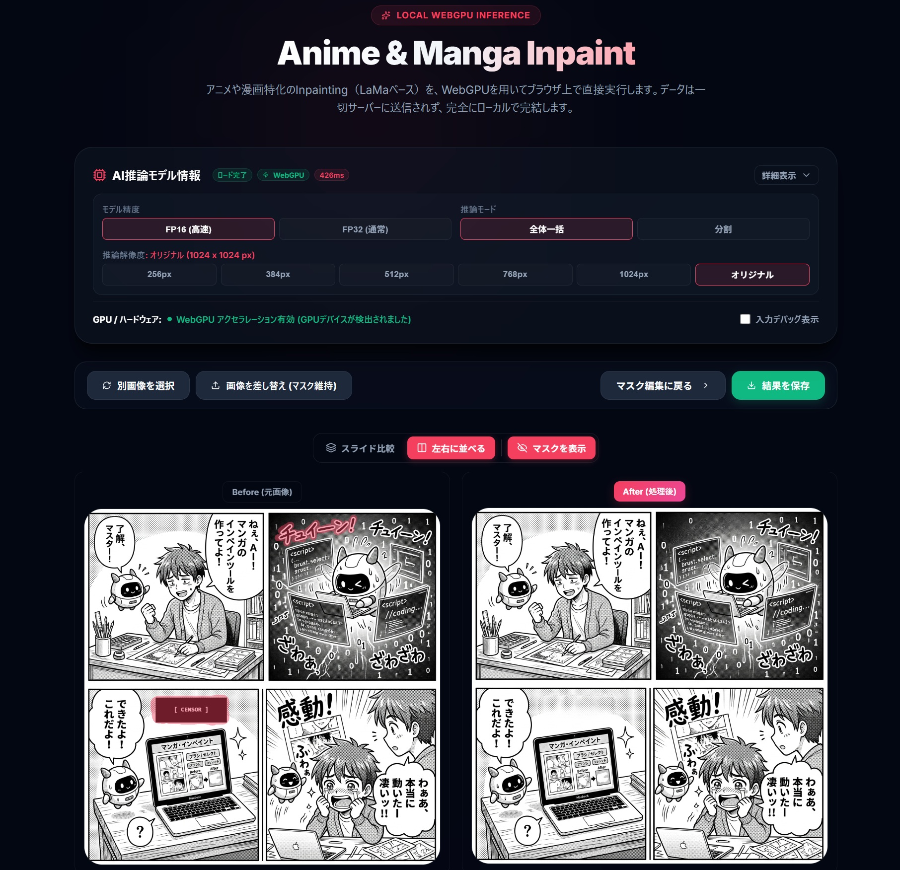

# Manga Inpaint (マンガ・インペイント)

🚀 **デモサイト (GitHub Pages):** [https://syuchan1005.github.io/manga-inpaint/](https://syuchan1005.github.io/manga-inpaint/)

Manga Inpaint は、Webブラウザ上で動作するAI搭載のマンガ画像修復（インペイント）アプリケーションです。画像上で修復したい箇所（セリフ、トーン、ゴミ、不要なオブジェクトなど）をブラシでマスクするだけで、周囲の文脈に合わせて自然に画像を補完・修復します。

サーバーへの画像アップロードは一切行わず、**ONNX Runtime Web** を用いてブラウザ側（WebGPU / WASM）で完全にローカル推論を実行するため、プライバシーが保護され、高速に動作します。

---

## 📸 スクリーンショット (Screenshot)



---

## 🌟 主な特徴 (Features)

- **ブラウザ完結型 AI ローカル推論**
  - **WebGPU バックエンド**を優先的にサポートし、対応ブラウザではネイティブ GPU による超高速推論を行います。
  - WebGPU 非対応環境やエラー発生時には、自動的に **WebAssembly (WASM)** バックエンドへフォールバックします。
- **ハイブリッド FP16/FP32 最適化モデル**
  - LaMa Manga モデルを独自の Python スクリプトで変換。白飛びや精度低下を招きやすい Fourier Units や BatchNormalization、および入出力境界層は FP32 のまま維持し、重い畳み込み層（バックボーン）のみを FP16 化。画質を維持しつつ、ファイルサイズを約半分（115MB）に軽量化しました。

---

## 🤖 使用モデルについて (Model Info)

本プロジェクトで使用しているモデルは、画像インペイント（修復）の世界的スタンダードである **LaMa** から始まり、複数の段階を経てマンガ用途・ブラウザ実行用に最適化されたものです。

### 📌 モデルの系譜 (Lineage)

1. **ベース技術: LaMa (Large Mask Inpainting) / [advimman](https://github.com/advimman/lama)**
   - 高速フーリエ変換 (FFT) を取り入れた「Fast Fourier Convolution (FFC)」を採用することで、巨大なマスクに対しても文脈を考慮した高精度な補完を行うことができ、解像度の変化にも極めて強い (Resolution-robust) 特徴を持ちます。
2. **アニメ・マンガへの特化: AnimeMangaInpainting (anime-lama) / [dreMaz](https://huggingface.co/dreMaz/AnimeMangaInpainting)**
   - オリジナルの LaMa モデルをベースに、**約 30 万枚のアニメ・マンガ画像データセット**でファインチューニングしたモデルです。
   - 線画、トーン、ベタなどのマンガ特有の描画表現に対して、標準の LaMa モデルを遥かに凌駕する高品質な補完クオリティを発揮します。画像修復ツール「IOPaint (旧 LaMa-Cleaner)」などでも広く採用されています。
3. **ONNX / 動的サイズ対応: lama-manga-onnx-dynamic / [ogkalu](https://huggingface.co/ogkalu/lama-manga-onnx-dynamic)**
   - IOPaint で使用されている PyTorch 版のモデルを **ONNX 形式にエクスポート**したモデルです。
   - 一般的な LaMa ONNX モデルが `512x512` などの固定サイズ入出力しか受け付けないのに対し、入力画像に合わせてサイズを動的に変更できる **Dynamic Shape** に対応させています。これにより、ブラウザ上で多様なアスペクト比・解像度の画像をシームレスに処理できます。
   - ONNX 環境下での互換性・推論の最適化のため、内部の `FourierUnit` 周りを JIT 構造として調整してエクスポートされています。

---

### 📦 提供しているモデルバリエーション (Our Models)

本プロジェクトでは、`ogkalu` の ONNX モデルをベースに、ブラウザ実行に最適化させた以下の 2 つのバリエーションを用意しています。

1. **Hybrid FP16/FP32 Model** (推奨・デフォルト)
   - ファイル名: `lama-manga-onnx-dynamic-fp16.onnx`
   - サイズ: **約 115 MB** (オリジナルから約 44% 削減)
   - 特徴: WebGPU での高速処理のため畳み込み層を FP16 に変換しつつ、インペイント画像特有の白飛び (White patches) や劣化を防ぐために Fourier Units や BatchNorm、および入出力境界層は FP32 のまま維持したハイブリッド構成です。
2. **Float32 Model** (オリジナル)
   - ファイル名: `lama-manga-onnx-dynamic.onnx`
   - サイズ: **約 206 MB**
   - 特徴: オリジナルの LaMa Manga ONNX モデルです。

---

## ⚙️ セットアップとビルド方法 (Setup & Build)

### 前提条件
- **Node.js** (v18以上) または **Bun**
- **Python** (v3.10以上) - モデルのダウンロード・最適化変換スクリプトの実行に必要。`uv` パッケージマネージャーの利用を推奨します。

### 1. 依存関係のインストール

プロジェクトのルートディレクトリで以下を実行します。

```bash
# npm を使用する場合
npm install

# Bun を使用する場合
bun install
```

### 2. AI モデルの準備 (ダウンロード & 変換)

以下のコマンドを実行すると、自動的に Python スクリプトが走り、オリジナルモデルのダウンロード、ハイブリッド FP16 モデルへの変換、および整合性チェックを行います。

```bash
# npm を使用する場合
npm run prepare-models

# Bun を使用する場合
bun run prepare-models
```

> [!NOTE]
> この処理には Python コマンド `uv run` が使用されます。バックグラウンドで `scripts/download-model.py`、`scripts/convert-fp16.py`、`scripts/verify-model.py` が順番に実行され、変換された ONNX ファイルが `public/models/` 内に生成されます。

### 3. 開発サーバーの起動

ローカルでの開発用サーバーを立ち上げます。

```bash
# npm を使用する場合
npm run dev

# Bun を使用する場合
bun run dev
```

起動後、コンソールに表示される URL (通常は `http://localhost:5173`) にブラウザでアクセスします。

### 4. プロダクションビルド

本番環境用の最適化された静的ファイルをビルドします。

```bash
# npm を使用する場合
npm run build

# Bun を使用する場合
bun run build
```

ビルドされた成果物は `dist/` ディレクトリに出力されます。

---

## 📁 プロジェクト構造 (Project Structure)

```text
manga-inpaint/
├── public/
│   └── models/          <- ダウンロード・変換された ONNX モデルの保存先 (git ignore)
├── scripts/
│   ├── download-model.py <- Hugging FaceからモデルをダウンロードするPythonスクリプト
│   ├── convert-fp16.py   <- 高精度ハイブリッドFP16/FP32モデルへ変換するスクリプト
│   ├── verify-model.py   <- ONNX Runtimeでのモデル整合性検証スクリプト
│   └── test_inference.py <- FP32とFP16モデルの推論結果比較用テストスクリプト
├── src/
│   ├── components/      <- UIコンポーネント (ModelSelector, MaskCanvas, HistorySection など)
│   ├── lib/
│   │   ├── inference.ts       <- ONNX Runtime Web を用いた推論・ロード処理
│   │   └── imageProcessing.ts <- Tensor変換や画像データ処理用のユーティリティ
│   ├── types/           <- TypeScript 型定義
│   ├── App.tsx          <- アプリケーションのメインエントリー
│   └── main.tsx
├── package.json
└── vite.config.ts
```
